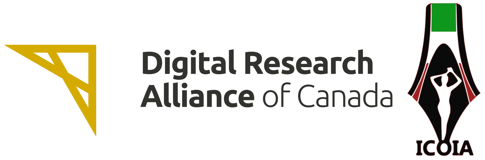
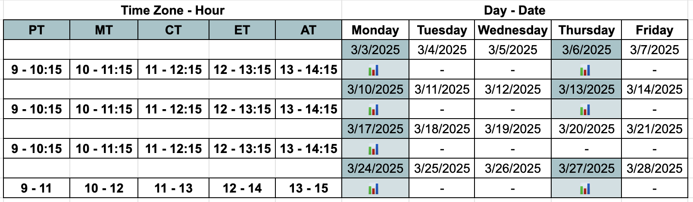

# 🇨🇦 Exclusive Research Computing Bootcamp 

<h2 id="general">General Information</h2>

  <strong>Team Leader:</strong>
  <ul>
    <a href="https://orcid.org/0000-0002-0567-7673">Dr. Mona Parizadeh </a>(Ph.D., PDF) Senior Postdoctoral Associate @ UofC Cumming School of Medicine & ICOIA's President
  </ul> 

  <strong>Instructors: </strong>
  <ul>
    <a href="https://www.cermofc.uqam.ca/en/technological-platforms/bio-informatics/"> Farzaneh Rahmdani </a>(M.Sc.) Research Assistant @ UQAM, Bioinformatic Platform Manager @ CERMO-FC, & ICOIA's Member
  </ul>
  <ul>
    <a href="https://www.linkedin.com/in/golrokh-vitae/?originalSubdomain=ca"> Golrokh Kiani</a> (M.Sc.) Bioinformatician @ Centre de recherche Azrieli du CHU Sainte-Justine & ICOIA's Governance Board Member
  </ul>  

  <strong>Teacher Assistant: </strong>
  <ul>
  <a href="https://ca.linkedin.com/in/shokoufeh-manouchehr-01b20a174"> Shokoufeh Manouchehr </a>(Ph.D. Student) CERC Lab Supervisor @ UofC & ICOIA's Member
  </ul>

  <strong>Organized by:</strong>
  <a href="https://icoia.org">ICOIA </a>(International Community of Iranian Academics)

  <strong>Funded by:</strong>
  <a href="https://alliancecan.ca/en">Digital Research Alliance of Canada </a>

  <strong>Objective:</strong>
  Bridging Gaps in Research Computing for Canadian Persian-speaking Immigrants

  <strong>Workshop Duration and Commitment:</strong>
  <ul>
    <li><strong>Timeframe</strong>: Mondays and Thursdays; March 3 to March 27, 2025</li> 
    <li><strong>Sessions</strong>: Five 75-minute sessions</li>
    <li><strong>Hands-On Projects</strong>: Two 2-hour sessions</li>
    <li><strong>Format</strong>: Online</li>
    <li><strong>Additional Support</strong>: We provide private or small group sessions on demand</li>  
  </ul>

  
  

  <strong>Requirements:</strong> 

<ul>
  <li>Laptop with a Mac, Linux, or Windows operating system (not a tablet, Chromebook, etc.) with administrative privileges</li>
  <li>Access to Wifi</li>
  <li>Excel or any text editor installed (e.g. TextWrangler, Notepad, BBEdit, etc.)</li>
</ul>

  <strong>Contact:</strong>
  <a href="mailto:{{icoia.onlineschool@gmail.com}}">icoia.onlineschool@gmail.com</a> 

<!--p id="register">
  <strong>Registration:</strong> 
  Please complete <a href="https://forms.gle/eShNkxNoUn4UZ9Eq5"><strong>this survey</strong></a> first, and then <a href="https://forms.gle/S3ovg69fZrE3zhq26"><strong>register here</strong></a>. 
</p-->

To ask questions about the course, communicate with the instructor and get informed about other free training courses, become a member of the ICOIA Online School 
  <a href="https://t.me/+jIfI2LibaBo2Yzc8?fbclid=PAZXh0bgNhZW0CMTEAAaZlAjc5hfp7mpqw7f8RxznZJ41NhZzFBl5LOjO07NjkorsvyXNDRH0pkNg_aem_l02uj-8pTJF5BiOA2yLSNQ">Telegram Group</a>.

<h2 id="audience">Audience</h2>

  We welcome participants who:

<ul>
  <li>speak Farsi</li>
  <li>live in Canada</li>
  <li>are affiliated with a Canadian university or research institution</li>
  <li>currently work with data or plan to in the future</li>
</ul>

  This course is suitable for:

<ul>
  <li><strong>Levels</strong>: Beginner & Intermediate</li>

  <li><strong>Fields</strong>: including, but not limited to:</li>

  <ul>
    <li>Agriculture and Natural Resources</li>
    <li>AI and Machine Learning</li>
    <li>Bioinformatics</li>
    <li>Biological Sciences</li>
    <li>Biomolecular simulation</li>
    <li>Computational chemistry</li>
    <li>Computer Science</li>
    <li>CFD</li>
    <li>Engineering</li>
    <li>GIS</li>
    <li>Humanities and Social Sciences</li>
    <li>Medicine</li>
    <li>Microbiology</li>
    <li>Research Data Management</li>
    <li>Subatomic physics</li>
    <li>Veterinary</li>
    </ul>
</ul>

<ul>
  <li><strong>Language</strong>: Farsi</li>
</ul>  

<h2 id="outline">Outline</h2>

  This course covers the following material:

<ul>
  <li>Introduction to Compute Canada resources</li>
  <li>High-Performance Computing (HPC)</li> 
  <li>Linux</li>
  <li>Bash scripting</li>
  <li>Slurm workload manager</li>
  <li>Running jobs</li>
  <li>Research data management</li>
  <li>Data transfer: Globus</li>
  <li>JupyterHub</li>
  <li>Hands-on projects</li>
</ul>
